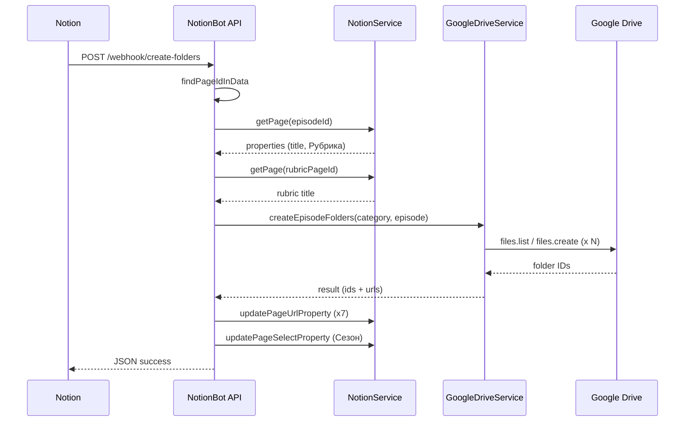

# Создание папок Google Drive по рубрике

Документация по системе из проекта **NotionBot**. Описывает автоматическое создание иерархии папок на Google Drive при нажатии кнопки в базе эпизодов Notion. Подходит для переноса на другой сайт.

---

## 1. Назначение

При нажатии кнопки в строке эпизода Notion:

1. Читается название эпизода и рубрика (категория)
2. На Google Drive создаётся дерево папок: `Сериал -> Рубрика -> Эпизод -> подпапки`
3. Ссылки на папки записываются обратно в свойства строки Notion

**Триггер:** `POST /webhook/create-folders`  
**Альтернатива без Notion:** `POST /drive/create-folders` (прямой API)

---

## 2. Архитектура

```
Notion (кнопка в базе эпизодов)
    |
    v
POST /webhook/create-folders  -->  NotionController.handleCreateFoldersWebhook()
    |
    +-- findPageIdInData(body)
    +-- getPage(pageId)                         # название эпизода + рубрика
    +-- resolveCategoryName()                     # Relation "Рубрика" или fallback
    |
    v
GoogleDriveService.createEpisodeFolders()
    |
    +-- ensureAuth()                              # OAuth2 + drive-token.json
    +-- findOrCreateFolder(root, categoryName)    # папка рубрики
    +-- findOrCreateFolder(category, episodeTitle)
    +-- findOrCreateFolder(...) x N               # EPISODE_STRUCTURE
    |
    v
NotionService.updatePageUrlProperty() / updatePageSelectProperty()
    |
    v
Ответ JSON со ссылками на все папки
```

### Файлы в NotionBot

| Файл                                           | Роль                                                           |
| ---------------------------------------------- | -------------------------------------------------------------- |
| `dist/notion/notion.controller.js`             | Webhook, резолв рубрики, запись в Notion                       |
| `dist/google-drive/google-drive.service.js`    | OAuth, Drive API, создание папок                               |
| `dist/google-drive/google-drive.controller.js` | Прямой REST `POST /drive/create-folders`                       |
| `dist/notion/notion.service.js`                | `getPage`, `updatePageUrlProperty`, `updatePageSelectProperty` |
| `scripts/drive-auth.js`                        | Первичная OAuth-авторизация                                    |
| `scripts/run-drive-auth.js`                    | Запуск auth с загрузкой `.env`                                 |

---

## 3. API endpoints

| Метод  | Путь                      | Назначение                         |
| ------ | ------------------------- | ---------------------------------- |
| `POST` | `/webhook/create-folders` | **Основной flow** (Notion webhook) |
| `POST` | `/drive/create-folders`   | Прямое создание без Notion         |

**Production URL:** `https://apinotion.teeny.games/webhook/create-folders`  
**Локально:** `http://localhost:{PORT}/webhook/create-folders`

### Прямой API (без Notion)

```http
POST /drive/create-folders
Content-Type: application/json

{
  "categoryName": "История",
  "episodeTitle": "Эпизод 42. Приключение",
  "parentFolderId": "optional-root-folder-id"
}
```

### Ответ при успехе

```json
{
  "status": "success",
  "message": "Папки созданы в Google Drive",
  "episodeFolderId": "1abc...",
  "episodeFolderUrl": "https://drive.google.com/drive/folders/1abc...",
  "categoryFolderId": "2def...",
  "categoryFolderUrl": "https://drive.google.com/drive/folders/2def...",
  "folders": {
    "footage": "...",
    "voiceover": "...",
    "rawVoiceover": "...",
    "finishedVoiceover": "...",
    "musicSfxInterjections": "...",
    "animatics": "...",
    "editing": "...",
    "review": "...",
    "finishedVideo": "...",
    "localization": "..."
  },
  "urls": {
    "footage": "https://drive.google.com/drive/folders/...",
    "...": "..."
  }
}
```

### Статусы ошибок

| status            | Когда                                           |
| ----------------- | ----------------------------------------------- |
| `success`         | Папки созданы, Notion обновлён                  |
| `partial_success` | Папки созданы, но ссылка в Notion не записалась |
| `error`           | Нет page_id, нет title, Drive 404, auth failed  |

---

## 4. Иерархия папок на Google Drive

```
{GOOGLE_DRIVE_SERIES_FOLDER_ID}     <- корень сериала
|
+-- {categoryName}                    <- рубрика (например "История", "Без рубрики")
    |
    +-- {episodeTitle}                <- название эпизода из Notion title
        |
        +-- 1. ФУТАЖИ И АРТ
        +-- 2. ЗВУКИ
        |   +-- 1. СЫРАЯ ОЗВУЧКА
        |   +-- 2. ГОТОВАЯ ОЗВУЧКА
        |   +-- 3. МУЗЫКА/SFX/МЕЖДОМЕТИЯ
        +-- 3. АНИМАТИКИ
        +-- 4. МОНТАЖ
        |   +-- 1. РЕВЬЮ
        |   +-- 2. ГОТОВЫЙ РОЛИК
        +-- 5. ЛОКАЛИЗАЦИЯ
```

### Константа `EPISODE_STRUCTURE`

Определена в `google-drive.service.js`:

```javascript
const EPISODE_STRUCTURE = [
  { name: '1. ФУТАЖИ И АРТ', key: 'footage' },
  {
    name: '2. ЗВУКИ',
    key: 'voiceover',
    children: [
      { name: '1. СЫРАЯ ОЗВУЧКА', key: 'rawVoiceover' },
      { name: '2. ГОТОВАЯ ОЗВУЧКА', key: 'finishedVoiceover' },
      { name: '3. МУЗЫКА/SFX/МЕЖДОМЕТИЯ', key: 'musicSfxInterjections' },
    ],
  },
  { name: '3. АНИМАТИКИ', key: 'animatics' },
  {
    name: '4. МОНТАЖ',
    key: 'editing',
    children: [
      { name: '1. РЕВЬЮ', key: 'review' },
      { name: '2. ГОТОВЫЙ РОЛИК', key: 'finishedVideo' },
    ],
  },
  { name: '5. ЛОКАЛИЗАЦИЯ', key: 'localization' },
];
```

**Идемпотентность:** `findOrCreateFolder` сначала ищет папку по имени в родителе. Повторный вызов не создаёт дубликаты.

---

## 5. Резолв рубрики (categoryName)

Реализовано в `handleCreateFoldersWebhook`. Внутреннее имя переменной - `categoryName`, источник - поле **Рубрика** в Notion.

### Приоритет определения рубрики

```
1. Relation "Рубрика" (case-insensitive)
   -> берётся первый linked page ID
   -> GET /pages/{linkedId}
   -> title связанной страницы = categoryName

2. Fallback: "Рубрика Текст" (regex: /^рубрика\s*текст$/i)
   -> formula.string / formula.number
   -> rollup (joined plain_text)

3. Default: "Без рубрики"
```

### Откуда читаются данные

| Данные             | Источник                                                         |
| ------------------ | ---------------------------------------------------------------- |
| `episodeTitle`     | Первое свойство с `type === 'title'` на странице эпизода         |
| Relation `Рубрика` | `page.properties` или fallback `data.data.properties` из webhook |
| `Рубрика Текст`    | `extractRubricTextFromPropertyMaps([props, webhookProps])`       |

### Функция `extractRubricTextFromPropertyMaps`

```javascript
// Ищет свойство по regex /^рубрика\s*текст$/i
// formula -> formula.string или formula.number
// rollup -> join rollup.array[].plain_text / title[0].plain_text
```

### Override корневой папки

В теле webhook можно передать:

```json
{ "parentFolderId": "custom-root-folder-id" }
```

Иначе используется `GOOGLE_DRIVE_SERIES_FOLDER_ID` из `.env`.

---

## 6. Google Drive API

### Авторизация (OAuth2, не service account)

| Файл        | Путь по умолчанию                           |
| ----------- | ------------------------------------------- |
| Credentials | `youtube-credentials.json` (корень проекта) |
| Token       | `tokens/drive-token.json`                   |

Переопределение через env:

- `DRIVE_CREDENTIALS_PATH` или `YOUTUBE_CREDENTIALS_PATH`
- `DRIVE_TOKEN_PATH`

**Scope:** `https://www.googleapis.com/auth/drive`

**Первичная авторизация:**

```bash
npm run drive-auth
# или
node scripts/run-drive-auth.js
```

Скрипт открывает OAuth URL, пользователь вводит code, токен сохраняется в `tokens/drive-token.json`. Токен автообновляется при истечении (`oAuth2Client.on('tokens', ...)`).

### `findOrCreateFolder(parentId, folderName)`

**Поиск:**

```javascript
const q = `'${parentId}' in parents and name = '${escaped}' and mimeType = 'application/vnd.google-apps.folder' and trashed = false`;

drive.files.list({
  q,
  fields: 'files(id, name)',
  spaces: 'drive',
  supportsAllDrives: true,
  includeItemsFromAllDrives: true,
});
```

**Создание (если не найдено):**

```javascript
drive.files.create({
  requestBody: {
    name: folderName,
    mimeType: 'application/vnd.google-apps.folder',
    parents: [parentId],
  },
  fields: 'id, name',
  supportsAllDrives: true,
});
```

Имена экранируются: `\` -> `\\`, `'` -> `\'`.

### URL папки

```javascript
function toDriveUrl(fileId) {
  return `https://drive.google.com/drive/folders/${fileId}`;
}
```

---

## 7. Запись обратно в Notion

После создания папок обновляются свойства страницы эпизода:

| Свойство Notion   | Значение                        |
| ----------------- | ------------------------------- |
| `Google Drive`    | `result.episodeFolderUrl`       |
| `Сезон`           | `getSeasonLabel(new Date())`    |
| `Готовая озвучка` | `result.urls.finishedVoiceover` |
| `Сырая озвучка`   | `result.urls.rawVoiceover`      |
| `Футажи`          | `result.urls.footage`           |
| `Аниматик`        | `result.urls.animatics`         |
| `Локализация`     | `result.urls.localization`      |
| `Готовый ролик`   | `result.urls.finishedVideo`     |

### Логика сезона (`getSeasonLabel`)

По текущей дате:

- Январь, Февраль, Декабрь -> `Зима`
- Март, Апрель, Май -> `Весна`
- Июнь, Июль, Август -> `Лето`
- Сентябрь, Октябрь, Ноябрь -> `Осень`

Формат: `{Сезон}/{YY}`, например `Весна/26`.

### `updatePageUrlProperty(pageId, propertySearchName, url)`

1. GET страницы
2. Fuzzy match: имя свойства содержит `propertySearchName` (case-insensitive) и `type === 'url'`
3. PATCH `/pages/{id}` с `{ properties: { [key]: { url: value } } }`

### `updatePageSelectProperty(pageId, propertySearchName, selectValue)`

1. Ищет `select`, `status` или `multi_select` по exact/fuzzy match имени
2. PATCH с соответствующим форматом (`select: { name }`, `status: { name }`, и т.д.)

Ошибки обновления подпапок логируются как warning, основной flow не падает.

---

## 8. Конфигурация

### Переменные окружения

| Переменная                      | Обязательна | Описание                           |
| ------------------------------- | ----------- | ---------------------------------- |
| `NOTION_TOKEN`                  | Да          | Integration token Notion           |
| `GOOGLE_DRIVE_SERIES_FOLDER_ID` | Да\*        | ID корневой папки сериала на Drive |
| `PORT`                          | Нет         | HTTP порт (default `25570`)        |
| `DRIVE_CREDENTIALS_PATH`        | Нет         | Путь к OAuth credentials JSON      |
| `DRIVE_TOKEN_PATH`              | Нет         | Путь к сохранённому токену         |

\*Есть hardcoded fallback: `1ZJ04kKANlxhaupKjsjk6dhfgb6OZei9y`

### Файлы на диске

```
NotionBot/
  .env
  youtube-credentials.json       # OAuth client (Google Cloud Console)
  tokens/
    drive-token.json             # сохранённый access/refresh token
```

### Зависимости

```json
{
  "@nestjs/common": "^10.4.20",
  "@nestjs/config": "^3.2.3",
  "googleapis": "^171.4.0"
}
```

---

## 9. Схема базы эпизодов в Notion

Минимально необходимые свойства:

| Свойство        | Тип                  | Направление                              |
| --------------- | -------------------- | ---------------------------------------- |
| Title           | `title`              | read (название эпизода)                  |
| Рубрика         | `relation`           | read (предпочтительный источник рубрики) |
| Рубрика Текст   | `formula` / `rollup` | read (fallback)                          |
| Google Drive    | `url`                | write                                    |
| Сезон           | `select` / `status`  | write                                    |
| Готовая озвучка | `url`                | write                                    |
| Сырая озвучка   | `url`                | write                                    |
| Футажи          | `url`                | write                                    |
| Аниматик        | `url`                | write                                    |
| Локализация     | `url`                | write                                    |
| Готовый ролик   | `url`                | write                                    |

### База рубрик (отдельная)

Страницы, на которые ссылается Relation `Рубрика`. Используется **title** связанной страницы как имя папки.

---

## 10. Настройка Notion automation

1. Integration с доступом к базе эпизодов и базе рубрик
2. Кнопка в базе эпизодов:
   - Action: Send webhook
   - URL: `https://your-domain.com/webhook/create-folders`
   - Method: POST
3. Убедиться, что webhook передаёт ID текущей строки (page)

---

## 11. Настройка Google Cloud

1. Создать проект в Google Cloud Console
2. Включить **Google Drive API**
3. Создать OAuth 2.0 Client ID (Desktop app или Web)
4. Скачать JSON -> `youtube-credentials.json`
5. Запустить `npm run drive-auth` под аккаунтом, у которого есть доступ к корневой папке сериала
6. Дать этому аккаунту доступ к `GOOGLE_DRIVE_SERIES_FOLDER_ID` (Editor)
7. Для Shared Drives: аккаунт должен быть членом Shared Drive

---

## 12. Перенос на другой сайт

### Вариант A: полный перенос (Notion + Drive)

Скопировать три слоя:

1. **Webhook handler** - резолв page_id, episodeTitle, categoryName
2. **Drive service** - `ensureAuth`, `findOrCreateFolder`, `createEpisodeFolders`, `EPISODE_STRUCTURE`
3. **Notion write-back** - обновление URL/select свойств

### Вариант B: только Drive (без Notion)

Достаточно endpoint:

```javascript
POST /drive/create-folders
{ categoryName, episodeTitle, parentFolderId? }
```

Клиент сам передаёт рубрику и название.

### Вариант C: другой CMS вместо Notion

Заменить только слой чтения/записи метаданных:

- Input: `{ rubric: string, episodeTitle: string }`
- Output: записать `folders.urls` в поля вашей CMS

`GoogleDriveService.createEpisodeFolders` остаётся без изменений.

### Псевдокод

```python
async def create_folders_webhook(body):
    page_id = find_page_id(body)
    page = await notion.get_page(page_id)
    episode_title = extract_title(page)
    category_name = await resolve_rubric(page, body)

    result = await drive.create_episode_folders(
        category_name=category_name,
        episode_title=episode_title,
        parent_folder_id=body.get("parentFolderId"),
    )

    await notion.update_url(page_id, "Google Drive", result.episode_folder_url)
    await notion.update_select(page_id, "Сезон", get_season_label())
    for prop, url in SUBFOLDER_MAPPING.items():
        await notion.update_url(page_id, prop, result.urls[url])

    return {"status": "success", **result}
```

### Что адаптировать при переносе

| Параметр             | Где                                                               |
| -------------------- | ----------------------------------------------------------------- |
| Структура папок      | `EPISODE_STRUCTURE`                                               |
| ID корневой папки    | `GOOGLE_DRIVE_SERIES_FOLDER_ID`                                   |
| Имена свойств Notion | `handleCreateFoldersWebhook` + `subfolderUpdates`                 |
| Логика рубрики       | `handleCreateFoldersWebhook`, `extractRubricTextFromPropertyMaps` |
| OAuth credentials    | `youtube-credentials.json` / env paths                            |
| Маппинг сезонов      | `getSeasonLabel`                                                  |

---

## 13. Sequence diagram



---

## 14. Ограничения и edge cases

- Используется **только первая** связь в Relation `Рубрика`, если их несколько
- OAuth-аккаунт должен иметь права на корневую папку (не service account)
- Имена папок чувствительны к точному совпадению (поиск по `name = '...'`)
- Спецсимволы в именах экранируются, но лучше избегать `'` и `\` в названиях эпизодов
- При 404 Drive возвращается подсказка проверить `GOOGLE_DRIVE_SERIES_FOLDER_ID`
- Обновление `Сезон` и подпапок - best effort (warning при ошибке, не fail)
- `partial_success` если главная ссылка `Google Drive` не записалась, но папки уже созданы

---

## 15. Отладка

Логи с префиксом `[create-folders]`:

```
Шаг 1: поиск page_id
Шаг 2: получение страницы из Notion API
Шаг 3: вызов createEpisodeFolders
Шаг 4: обновление полей Google Drive в Notion
```

Логи `[findOrCreateFolder]` / `[createEpisodeFolders]` / `[ensureAuth]` в GoogleDriveService.

Типичные ошибки:

| Симптом                       | Решение                                                           |
| ----------------------------- | ----------------------------------------------------------------- |
| `Токен Drive не найден`       | Запустить `npm run drive-auth`                                    |
| `File not found` / 404        | Проверить `GOOGLE_DRIVE_SERIES_FOLDER_ID` и доступ OAuth-аккаунта |
| `page_id не найден`           | Кнопка должна быть в database view, не на отдельной странице      |
| `Не найдено название эпизода` | У строки должен быть заполнен title                               |
| Папка `Без рубрики`           | Не заполнено Relation `Рубрика` и пустой `Рубрика Текст`          |
| Дубликаты папок               | Не должны создаваться при одинаковых именах (idempotent search)   |
